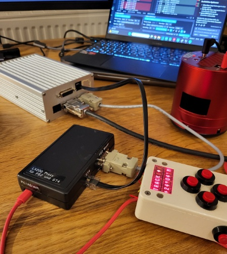
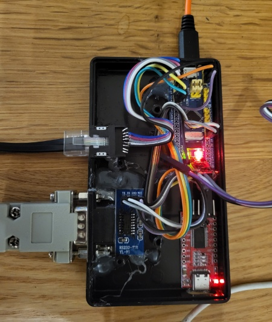
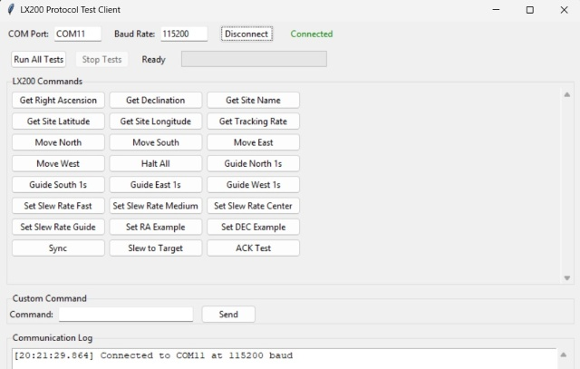

# LX200 Proxy

STM32F103 based LX200 protocol proxy for telescope control systems.

I developed this project because I had trouble connecting the large refractor telescope with FS2 mount from my astronomy club to the new, highly integrated ASI2600MC Air camera with integrated guiding sensor. It's possible to choose the FS2 driver in ASIAir, but sync, goto, and guiding do not work. This failed due to missing spaces in two commands in the "Astro Electronic FS2" and LX200 drivers. Additionally, it turned out that the guiding commands (":Mgn0500#", etc.) are not supported and must be sent through the ST4 port instead. Therefore, this proxy was developed to make LX200 commands understandable for the FS2 and to control guiding commands via the ST4 output. Set the driver to "Astro Electronic FS2" to use this proxy. Further adaptations are conceivable, e.g., controlling the FS2 via Bluetooth with Stellarium Mobile, or creating a simplified version for USB->ST4 adapter only.

## Overview



### System Architecture

```
┌──────────────┐
│   ASIAir     │ (or other astronomy software)
│              │
└──────┬───────┘
       │ USB (Virtual COM)
       │ LX200 Protocol
┌──────▼───────────────────────────┐
│   LX200 Proxy (STM32F103)        │
│  ┌────────────────────────────┐  │
│  │  Protocol Translator       │  │
│  │  • LX200 ↔ FS2            │  │
│  │  • Command Parsing         │  │
│  │  • Space Insertion         │  │
│  └────────────────────────────┘  │
│  ┌────────────────────────────┐  │
│  │  ST4 Handler               │  │
│  │  • Duration-based Guiding  │  │
│  │  • 4 GPIO Outputs          │  │
│  └────────────────────────────┘  │
└────┬──────────────────────┬──────┘
     │ UART (9600 baud)     │ ST4 (4-wire)
     │ FS2 Protocol         │ N/S/E/W
┌────▼──────────────────────▼──────┐
│    FS2 Telescope Mount           │
│                                   │
└───────────────────────────────────┘
```


## Hardware

- **MCU**: STM32F103C8 (Blue Pill)
- **USB**: Virtual COM Port (CDC), connection to the astronomy software, no driver needed on Windows, Linux and ASIAir. You can set any baudrate (automatically handled)
- **UART2**: Connection to FS2 telescope mount (9600 baud)
- **UART1**: Debug output (115200 baud), can be used for flashing with the serial bootloader
- **ST4 Interface**: 4 GPIO pins for telescope guiding (PB12-PB15)

First Prototype:



## Features

### LX200 Protocol Support
- Standard LX200 commands (:GR#, :GD#, :GM#, etc.)
- Coordinate setting with space insertion for FS2 compatibility
- Site information queries
- Movement and slew rate commands

### ST4 Guiding
- Duration-based guiding commands (:Mgn1000# for 1000ms north)
- Hardware ST4 output on 5V tolerant GPIO pins
- Open-drain outputs
- Warning: no optocoupler is used in the simple version, be sure that the levels on mount side are max. 5V!

### FS2 Adapter
- Command translation between LX200 and FS2 protocols
- Space insertion for coordinate commands
- Passthrough for unsupported commands

### Debug Features
- Comprehensive UART debug output
- Command logging and response validation
- Error handling with optional system reset

### Next Features
- Support for Stellarium Mobile over Bluetooth
- Mode for simple USB -> ST4 translation (for mounts without interface)

## Build Requirements

- STM32CubeIDE 1.19.0 or later
- STM32F1 HAL drivers
- USB Device CDC library

## Flashing

### Method 1: UART Bootloader (Recommended)
The STM32F103 has a built-in UART bootloader that can be used without external programmer:

1. **Prepare hardware:**
   - Connect UART1 (PA9/TX, PA10/RX) to USB-Serial adapter
   - Set BOOT0 pin to HIGH (3.3V)
   - Reset the MCU

2. **Flash using STM32CubeProgrammer:**
   - Open STM32CubeProgrammer
   - Select UART interface
   - Choose correct COM port (115200 baud)
   - Load the .hex file
   - Click "Download"

3. **Alternative: stm32flash (command line):**
   ```
   stm32flash -w LX200_proxy.hex -v COM3
   ```

4. **Finish:**
   - Set BOOT0 back to LOW (GND)
   - Reset MCU to start application

### Method 2: ST-Link Programmer
Use ST-Link/V2 with STM32CubeProgrammer or STM32CubeIDE directly.

## Pin Configuration

```
UART1: PA9 (TX), PA10 (RX) - 115200 baud (Debug)
UART2: PA2 (TX), PA3 (RX) - 9600 baud (FS2)
ST4: PB12 (West), PB13 (North), PB14 (South), PB15 (East)
```

## Usage

1. Connect telescope mount to UART2
2. Connect to PC via USB (appears as virtual COM port)
3. Set astronomy software to LX200 mode
4. Commands are automatically translated and forwarded

### Supported Commands

**Information**: :GM#, :Gt#, :Gg#, :GT#, :GR#, :GD#  
**Movement**: :Mn#, :Ms#, :Me#, :Mw#, :Q#  
**Coordinates**: :Sr HH:MM:SS#, :Sd sDD:MM:SS#  
**Guiding**: :MgnNNNN#, :MgsNNNN#, :MgeNNNN#, :MgwNNNN#  
**Slew Rates**: :RS#, :RM#, :RC#, :RG#  

## Testing

A Python test client is included in the `testing/` directory. Requirements:
- Python 3.7+
- pyserial library

The client provides individual command testing and automated test sequences with result validation.



## Configuration

Fault handlers can be configured for debugging or production:
- Comment `#define FAULT_HANDLER_RESET_ON_ERROR` for debug mode (system hangs on faults)
- Uncomment for production mode (system resets on faults)

## Project Structure

```
Core/
  Inc/           - Header files
  Src/           - Source files
    main.c       - Main application and initialization
    lx200_server.c     - LX200 protocol parser
    lx200_fs2_adapter.c - FS2 command translation
    lx200_emulator.c    - Testing emulator
    st4_handler.c       - ST4 GPIO management
testing/
  lx200_client.py      - Python test application
```

## License

This project is licensed under the MIT License - see the [LICENSE](LICENSE) file for details.